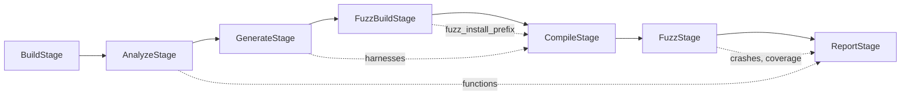

# FutagAssist Framework Architecture

## Design Principles

- **Protocol-based abstractions**: All extensible components defined as Python Protocols
- **Registry pattern**: Central registries for discovering and instantiating components
- **Plugin discovery**: Auto-load plugins from `plugins/` directory
- **Config-driven**: YAML configuration selects which implementations to use
- **Pipeline stages**: Skip/include stages via CLI flags or config
- **Language-agnostic core**: Language-specific logic lives in plugins

---

## High-Level Framework Architecture


---

## Protocol Interfaces (Abstract Base)

All extensible components are defined as Python `Protocol` classes in `src/futagassist/protocols/`:

```python
# protocols/llm_provider.py
from typing import Protocol

class LLMProvider(Protocol):
    """Protocol for LLM backends (OpenAI, Ollama, Anthropic, etc.)"""
    name: str
    
    def complete(self, prompt: str, **kwargs) -> str: ...
    def check_health(self) -> bool: ...


# protocols/fuzzer_engine.py
class FuzzerEngine(Protocol):
    """Protocol for fuzzing engines (libFuzzer, AFL++, Honggfuzz)"""
    name: str
    
    def fuzz(self, binary: Path, corpus_dir: Path, **options) -> FuzzResult: ...
    def get_coverage(self, binary: Path, profdata: Path) -> CoverageReport: ...
    def parse_crashes(self, artifact_dir: Path) -> list[CrashInfo]: ...


# protocols/language_analyzer.py
class LanguageAnalyzer(Protocol):
    """Protocol for language-specific analysis (C/C++, Python, Java, Go)"""
    language: str
    
    def get_codeql_queries(self) -> list[Path]: ...
    def extract_functions(self, db_path: Path) -> list[FunctionInfo]: ...
    def generate_harness_template(self, func: FunctionInfo) -> str: ...
    def get_compiler_flags(self) -> list[str]: ...


# protocols/reporter.py
class Reporter(Protocol):
    """Protocol for output formats (JSON, SARIF, HTML, SVRES)"""
    format_name: str
    
    def report_coverage(self, data: CoverageReport, output: Path) -> None: ...
    def report_crashes(self, crashes: list[CrashInfo], output: Path) -> None: ...
    def report_functions(self, functions: list[FunctionInfo], output: Path) -> None: ...


# protocols/pipeline_stage.py
class PipelineStage(Protocol):
    """Protocol for pipeline stages"""
    name: str
    depends_on: list[str]
    
    def execute(self, context: PipelineContext) -> StageResult: ...
    def can_skip(self, context: PipelineContext) -> bool: ...
```

---

## Component Registry System

The registry discovers, registers, and instantiates components:

```python
# core/registry.py
class ComponentRegistry:
    """Central registry for all pluggable components"""
    
    _llm_providers: dict[str, type[LLMProvider]]
    _fuzzer_engines: dict[str, type[FuzzerEngine]]
    _language_analyzers: dict[str, type[LanguageAnalyzer]]
    _reporters: dict[str, type[Reporter]]
    _stages: dict[str, type[PipelineStage]]
    
    def register_llm(self, name: str, cls: type[LLMProvider]) -> None: ...
    def register_fuzzer(self, name: str, cls: type[FuzzerEngine]) -> None: ...
    def register_language(self, lang: str, cls: type[LanguageAnalyzer]) -> None: ...
    def register_reporter(self, fmt: str, cls: type[Reporter]) -> None: ...
    def register_stage(self, name: str, cls: type[PipelineStage]) -> None: ...
    
    def get_llm(self, name: str) -> LLMProvider: ...
    def get_fuzzer(self, name: str) -> FuzzerEngine: ...
    def get_language(self, lang: str) -> LanguageAnalyzer: ...
    def get_reporter(self, fmt: str) -> Reporter: ...
    
    def list_available(self) -> dict[str, list[str]]: ...
```

---

## Plugin Discovery System

Plugins are auto-discovered from `plugins/` directory:

```python
# core/plugin_loader.py
class PluginLoader:
    """Discovers and loads plugins from plugins/ directory"""
    
    def __init__(self, plugin_dirs: list[Path], registry: ComponentRegistry): ...
    
    def discover_plugins(self) -> list[PluginInfo]: ...
    def load_plugin(self, plugin_path: Path) -> None: ...
    def load_all(self) -> None: ...
```

Each plugin is a Python module with a `register(registry)` function:

```python
# plugins/llm/openai_provider.py
from futagassist.protocols import LLMProvider
from futagassist.core.registry import ComponentRegistry

class OpenAIProvider:
    name = "openai"
    
    def __init__(self, api_key: str, model: str = "gpt-4"): ...
    def complete(self, prompt: str, **kwargs) -> str: ...
    def check_health(self) -> bool: ...

def register(registry: ComponentRegistry):
    registry.register_llm("openai", OpenAIProvider)
```

---

## Pipeline Engine with Stage Control

```python
# core/pipeline.py
@dataclass
class PipelineConfig:
    stages: list[str]           # Ordered list of stage names
    skip_stages: list[str]      # Stages to skip
    stop_on_failure: bool
    
class PipelineEngine:
    """Executes pipeline stages with skip/include support"""
    
    def __init__(self, registry: ComponentRegistry, config: PipelineConfig): ...
    
    def run(self, context: PipelineContext) -> PipelineResult:
        for stage_name in self.config.stages:
            if stage_name in self.config.skip_stages:
                continue
            stage = self.registry.get_stage(stage_name)
            result = stage.execute(context)
            context.update(result)
        return context.finalize()
```

---

## Proposed Directory Structure

```
FutagAssist/
├── src/futagassist/
│   ├── __init__.py
│   ├── cli.py                      # Click-based CLI entry point
│   │
│   ├── protocols/                  # Abstract interfaces (Protocols)
│   │   ├── __init__.py
│   │   ├── llm_provider.py
│   │   ├── fuzzer_engine.py
│   │   ├── language_analyzer.py
│   │   ├── reporter.py
│   │   └── pipeline_stage.py
│   │
│   ├── core/                       # Framework core
│   │   ├── __init__.py
│   │   ├── config.py               # Config loading (YAML, .env)
│   │   ├── registry.py             # Component registry
│   │   ├── plugin_loader.py        # Plugin discovery
│   │   ├── pipeline.py             # Pipeline engine
│   │   ├── health.py               # Health checks
│   │   ├── exceptions.py           # Exception hierarchy
│   │   └── schema.py               # Pydantic models
│   │
│   ├── stages/                     # Built-in pipeline stages
│   │   ├── __init__.py
│   │   ├── build_stage.py
│   │   ├── analyze_stage.py
│   │   ├── generate_stage.py
│   │   ├── fuzz_build_stage.py   # Future: instrumented library build (see docs/FUZZ_BUILD_STAGE.md)
│   │   ├── compile_stage.py
│   │   ├── fuzz_stage.py
│   │   └── report_stage.py
│   │
│   └── utils/                      # Shared utilities
│       ├── __init__.py
│       ├── subprocess_utils.py
│       ├── llm_utils.py
│       └── codeql_utils.py
│
├── plugins/                        # Plugin directory (auto-discovered)
│   ├── llm/
│   │   ├── openai_provider.py
│   │   ├── ollama_provider.py
│   │   └── anthropic_provider.py
│   ├── fuzzers/
│   │   ├── libfuzzer_engine.py
│   │   └── aflpp_engine.py
│   ├── languages/
│   │   ├── cpp_analyzer.py
│   │   ├── python_analyzer.py
│   │   └── go_analyzer.py
│   └── reporters/
│       ├── json_reporter.py
│       ├── sarif_reporter.py
│       └── svres_reporter.py
│
├── ql/                             # CodeQL queries (per language)
│   ├── cpp/
│   │   ├── FunctionSignatures.ql
│   │   ├── FunctionUsageContext.ql
│   │   └── PublicAPI.ql
│   └── python/
│       └── FunctionSignatures.ql
│
├── config/
│   ├── default.yaml                # Default configuration
│   ├── pipeline.yaml               # Pipeline stage configuration
│   └── libs_projects.yaml          # Curated test projects
│
├── tests/
│   ├── test_registry.py
│   ├── test_pipeline.py
│   ├── test_plugin_loader.py
│   ├── test_stages/
│   └── test_plugins/
│
├── docs/
│   ├── ARCHITECTURE.md
│   ├── plugins.md                  # How to write plugins
│   └── configuration.md
│
├── pyproject.toml
├── Makefile
└── README.md
```

---

## Configuration System

### Main Config (`config/default.yaml`)

```yaml
# Component selection (resolved from registry)
llm_provider: openai
fuzzer_engine: libfuzzer
language: cpp
reporters:
  - json
  - sarif

# LLM settings
llm:
  model: gpt-4
  max_retries: 3
  temperature: 0.2

# Fuzzer settings
fuzzer:
  timeout: 10
  max_total_time: 300
  fork: 1
  rss_limit_mb: 2048

# Pipeline settings
pipeline:
  stages:
    - build
    - analyze
    - generate
    # - fuzz_build   # Future: add when implementing compile/fuzz; rebuilds library with debug + sanitizers (see FUZZ_BUILD_STAGE.md)
    - compile
    - fuzz
    - report
  skip_stages: []
  stop_on_failure: true
```

### Pipeline Override via CLI

```bash
# Skip specific stages
futagassist run --repo <url> --skip build --skip compile

# Only run specific stages
futagassist run --repo <url> --only analyze,generate

# Override component selection
futagassist run --repo <url> --llm ollama --fuzzer aflpp --language python
```

---

## Key Features

### Feature 1: Health Check (`futagassist check`)

- Verify all registered components can initialize
- Test selected LLM provider connectivity
- Check for CodeQL binary and version
- Validate fuzzer engine requirements (clang/libFuzzer or AFL++)
- Report missing dependencies with installation hints

### Feature 2: Build Stage (`futagassist build` / `BuildStage`)

- Parse README/INSTALL using LLM to extract build steps
- Inject `codeql database create --command="<build-cmd>"` wrapper
- LLM-assisted error recovery loop:
  - Capture stderr/stdout on failure
  - Send to LLM: "Build failed with error X. Suggest fix."
  - Apply fixes (install packages, modify build flags)
  - Retry up to N times
- Output: CodeQL database path

### Feature 3: Analysis Stage (`futagassist analyze` / `AnalyzeStage`)

- Delegate to `LanguageAnalyzer` plugin for language-specific queries
- Run CodeQL queries to extract:
  - Function signatures (name, params, return type)
  - Public API functions
  - Function call graphs
  - Memory allocation patterns
- **Optional LLM**: when configured, the stage can ask the LLM to suggest additional usage contexts (ordered function-call sequences) from function names and optional code; same best-effort pattern as build (no LLM or failure = analyzer output only)
- Export results via `Reporter` plugins
- Output: `FunctionInfo` list and `UsageContext` list

### Feature 4: Generation Stage (`futagassist generate` / `GenerateStage`)

- Build context for each target function using `LanguageAnalyzer`:
  - Required includes/imports
  - Type definitions
  - Example usage from codebase
- Prompt LLM to generate harness (template from `LanguageAnalyzer`)
- Validate generated code syntax
- Output: Generated fuzz target files

### Feature 5: Compilation Stage (`futagassist compile` / `CompileStage`)

- Use `LanguageAnalyzer.get_compiler_flags()` for language-specific flags
- Default C/C++: `-fsanitize=fuzzer,address -fprofile-instr-generate -fcoverage-mapping`
- LLM-assisted error fixing loop:
  - Parse compilation errors
  - Send to LLM for fixes
  - Apply and retry
- Output: Compiled binaries

### Feature 6: Fuzzing Stage (`futagassist fuzz` / `FuzzStage`)

Delegates to `FuzzerEngine` plugin. Built-in libFuzzer engine based on [Futag's fuzzer.py](https://github.com/ispras/Futag/blob/main/src/python/futag-package/src/futag/fuzzer.py):

- Configurable options: `fork`, `timeout`, `max_total_time`, `rss_limit_mb`
- Parse crash artifacts
- Optional GDB-based crash analysis
- Coverage collection via `llvm-profdata` and `llvm-cov`
- Output: `FuzzResult` with crashes and coverage

### Feature 7: Report Stage (`futagassist report` / `ReportStage`)

Delegates to `Reporter` plugins:

- **JSON**: Machine-readable function info, crashes, coverage
- **SARIF**: Static Analysis Results Interchange Format
- **SVRES**: Svace integration (from Futag)
- **HTML**: Human-readable coverage reports

---

## Full Pipeline Flow

All stages are implemented and can be run individually or together via `futagassist run`:



| Stage | CLI | Description |
|-------|-----|-------------|
| `build` | `futagassist build` | Create CodeQL database from repo |
| `analyze` | `futagassist analyze` | Extract functions via CodeQL queries |
| `generate` | `futagassist generate` | Generate fuzz harnesses (template + LLM) |
| `fuzz_build` | `futagassist fuzz-build` | Build library with debug + sanitizers |
| `compile` | `futagassist compile` | Compile harnesses into instrumented binaries |
| `fuzz` | `futagassist fuzz` | Run fuzzer on binaries, collect crashes |
| `report` | `futagassist report` | Generate reports (JSON, SARIF, HTML) |
| *all* | `futagassist run` | Run full pipeline with progress reporting |

See per-stage docs: [FUZZ_BUILD_STAGE.md](FUZZ_BUILD_STAGE.md), [COMPILE_STAGE.md](COMPILE_STAGE.md), [FUZZ_STAGE.md](FUZZ_STAGE.md), [REPORT_STAGE.md](REPORT_STAGE.md).

---

## Framework Data Flow


## Plugin Registration Flow


---

## Requirements

### Python Dependencies (Core)

- `click>=8.0` - CLI framework
- `pydantic>=2.0` - Data validation and schemas
- `python-dotenv>=1.0` - Environment variable loading
- `pyyaml>=6.0` - YAML config parsing
- `rich>=13.0` - Terminal output formatting
- `pytest>=8.0` - Testing framework

### Python Dependencies (Plugin-specific, optional)

- `openai>=1.0` - OpenAI provider plugin
- `httpx>=0.25` - Ollama/Anthropic provider plugins
- `anthropic>=0.20` - Anthropic provider plugin

### External Tools

Required (based on selected plugins):

- `codeql` - CodeQL CLI (v2.15+) - required for analysis
- `clang`/`clang++` - With libFuzzer support (for libFuzzer engine)
- `afl-fuzz` - AFL++ (for AFL++ engine plugin)
- `llvm-profdata`, `llvm-cov` - For coverage (libFuzzer engine)
- `gdb` (optional) - For crash debugging

---

## CLI Commands Summary

```bash
# Check environment and registered components
futagassist check [--verbose] [--skip-llm] [--skip-fuzzer] [--skip-plugins]

# List available plugins
futagassist plugins list

# Run full pipeline
futagassist run --repo <path> [--language cpp] [--stages s1,s2,...] [--skip s1,...] [--no-llm] [-v]

# Run individual stages
futagassist build --repo <path> [--language cpp] [--output <db-path>] [--overwrite] [--build-script <script>] [-v]
futagassist fuzz-build --repo <path> [--prefix <install-dir>] [--configure-options "..."] [-v]
futagassist analyze --db <path> [--output <json>] [--language cpp]
futagassist generate --functions <json> [--output <dir>] [--max-targets N] [--no-llm] [--no-validate] [--full-validate]
futagassist compile --targets <dir> [--output <dir>] [--prefix <install-dir>] [--compiler clang++] [--retry N] [--no-llm]
futagassist fuzz --binaries <dir> [--output <dir>] [--engine libfuzzer] [--max-time 60] [--timeout 30] [--fork 1]
futagassist report [--results <dir>] [--output <dir>] [--format json] [--format html] [--functions <json>]
```

---

## Implementation Phases

### Phase 0–4: Framework & Core Stages ✅

Protocols, `ComponentRegistry`, `PluginLoader`, `PipelineEngine`, `ConfigManager`, health checks, exception hierarchy, Pydantic schemas, CLI skeleton, `BuildStage`, `AnalyzeStage`, `GenerateStage`.

### Phase 5: Fuzz Build Stage ✅

`FuzzBuildStage` — builds library with debug + sanitizers (ASan/UBSan) and installs to a fuzz prefix.

### Phase 6: Compile Stage ✅

`CompileStage` — compiles fuzz harnesses with sanitizer flags, LLM-assisted error fixing, and retry logic.

### Phase 7: Fuzz & Report Stages ✅

`FuzzStage` — runs fuzzer on compiled binaries, parses crashes, collects coverage. `ReportStage` — generates reports in JSON, SARIF, HTML via registered `Reporter` plugins.

### Phase 8: Built-in Plugins ✅

- **LLM Providers**: OpenAI, Ollama, Anthropic
- **Fuzzer Engines**: libFuzzer, AFL++
- **Language Analyzers**: C/C++ (full)
- **Reporters**: JSON, SARIF, HTML

### Phase 9: Integration and Polish ✅

- Full pipeline command (`futagassist run`) with stage-by-stage progress reporting
- Configuration: `config/default.yaml`, `.env` support, environment variable overrides
- Documentation: [ARCHITECTURE.md](ARCHITECTURE.md), [CONFIGURATION.md](CONFIGURATION.md), [QUICKSTART.md](QUICKSTART.md), [PLUGINS.md](PLUGINS.md)
- Per-stage docs: [BUILD_WITH_CODEQL.md](BUILD_WITH_CODEQL.md), [ANALYZE_STAGE.md](ANALYZE_STAGE.md), [GENERATE_STAGE.md](GENERATE_STAGE.md), [FUZZ_BUILD_STAGE.md](FUZZ_BUILD_STAGE.md), [COMPILE_STAGE.md](COMPILE_STAGE.md), [FUZZ_STAGE.md](FUZZ_STAGE.md), [REPORT_STAGE.md](REPORT_STAGE.md)

---

## Extensibility Examples

### Adding a New LLM Provider

```python
# plugins/llm/gemini_provider.py
from futagassist.protocols import LLMProvider
from futagassist.core.registry import ComponentRegistry

class GeminiProvider:
    name = "gemini"
    
    def __init__(self, api_key: str, model: str = "gemini-pro"):
        self.client = genai.Client(api_key=api_key)
        self.model = model
    
    def complete(self, prompt: str, **kwargs) -> str:
        response = self.client.generate_content(prompt)
        return response.text
    
    def check_health(self) -> bool:
        try:
            self.complete("ping")
            return True
        except Exception:
            return False

def register(registry: ComponentRegistry):
    registry.register_llm("gemini", GeminiProvider)
```

### Adding a New Fuzzer Engine

```python
# plugins/fuzzers/honggfuzz_engine.py
from futagassist.protocols import FuzzerEngine

class HonggfuzzEngine:
    name = "honggfuzz"
    
    def fuzz(self, binary: Path, corpus_dir: Path, **options) -> FuzzResult:
        cmd = ["honggfuzz", "-f", str(corpus_dir), "--", str(binary)]
        # ... implementation
    
    def get_coverage(self, binary: Path, profdata: Path) -> CoverageReport:
        # ... implementation
    
    def parse_crashes(self, artifact_dir: Path) -> list[CrashInfo]:
        # ... implementation

def register(registry: ComponentRegistry):
    registry.register_fuzzer("honggfuzz", HonggfuzzEngine)
```

### Adding a New Language

```python
# plugins/languages/rust_analyzer.py
from futagassist.protocols import LanguageAnalyzer

class RustAnalyzer:
    language = "rust"
    
    def get_codeql_queries(self) -> list[Path]:
        return [Path("ql/rust/FunctionSignatures.ql")]
    
    def extract_functions(self, db_path: Path) -> list[FunctionInfo]:
        # Run Rust-specific queries
        ...
    
    def generate_harness_template(self, func: FunctionInfo) -> str:
        return '''
#![no_main]
use libfuzzer_sys::fuzz_target;

fuzz_target!(|data: &[u8]| {
    // Call {func.name}
});
'''
    
    def get_compiler_flags(self) -> list[str]:
        return ["-C", "passes=sancov", "-Z", "sanitizer=address"]

def register(registry: ComponentRegistry):
    registry.register_language("rust", RustAnalyzer)
```
