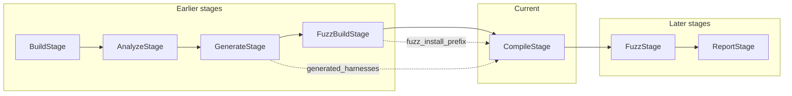

# Compile Stage

This document describes the **Compile** (compilation) stage for FutagAssist. It is implemented in `stages/compile_stage.py` and exposed via `futagassist compile`.

## Purpose

The compile stage takes **generated fuzz harnesses** (from the generate stage) and compiles them into **instrumented binaries** suitable for fuzzing. It handles:

- Compiler flag selection (from `LanguageAnalyzer` plugins or defaults)
- Linking against the instrumented library install from the fuzz-build stage
- LLM-assisted compilation error fixing with retry and exponential backoff
- Coverage instrumentation (`-fprofile-instr-generate -fcoverage-mapping`)

## Pipeline placement

- **Depends on:** `generate`, `fuzz_build`
- **Order:** `build` > `analyze` > `generate` > `fuzz_build` > **`compile`** > `fuzz` > `report`



## Inputs

| Input | Source | Description |
|-------|--------|-------------|
| `context.generated_harnesses` | Generate stage | List of `GeneratedHarness` objects with source code |
| `context.fuzz_install_prefix` | Fuzz Build stage | Path to instrumented library install (for `-L`, `-I`, `-rpath`) |
| `LanguageAnalyzer.get_compiler_flags()` | Plugin | Language-specific compiler flags (e.g. `-fsanitize=fuzzer -g`) |

## Outputs

| Output | Description |
|--------|-------------|
| `binaries_dir` | Directory containing compiled fuzz target binaries |
| `compiled` | List of successfully compiled targets with binary paths |
| `failed` | List of failed compilations with error messages |
| `compiled_count` / `failed_count` | Counts for summary |

## Default compiler flags

When no `LanguageAnalyzer` is registered or available, the stage uses these defaults for C/C++:

```
-fsanitize=fuzzer,address
-fprofile-instr-generate
-fcoverage-mapping
-g
-O1
-fno-omit-frame-pointer
```

The C++ analyzer plugin provides `["-fsanitize=fuzzer", "-g"]`, which will be used when available.

## Linking against fuzz install prefix

When `context.fuzz_install_prefix` is set (from the fuzz-build stage), the compile stage automatically adds:

- `-L<prefix>/lib` -- library search path
- `-Wl,-rpath,<prefix>/lib` -- runtime library path
- `-I<prefix>/include` -- include path

This allows fuzz targets to link against the instrumented (ASan/UBSan) library built by the fuzz-build stage.

## LLM-assisted error fixing

When compilation fails and an LLM provider is configured, the stage:

1. Sends the compilation errors and original source to the LLM
2. Receives a corrected version of the source code
3. Writes the corrected source and retries compilation
4. Uses exponential backoff between retries (1s, 2s, 4s, ...)
5. Stops after `max_retries` attempts or when the LLM responds `UNFIXABLE`

The LLM prompt asks for the corrected source only (no explanation, no markdown), which is validated for containing an entry point (`LLVMFuzzerTestOneInput` or `main`) before being applied.

## CLI usage

```bash
# Compile harnesses from generate stage output
futagassist compile --targets ./fuzz_targets --output ./fuzz_binaries

# With instrumented library from fuzz-build
futagassist compile --targets ./fuzz_targets --prefix ./install-fuzz

# Customize compiler and retries
futagassist compile --targets ./fuzz_targets --compiler clang++-17 --retry 5

# Disable LLM-assisted fixing
futagassist compile --targets ./fuzz_targets --no-llm

# Set compiler timeout
futagassist compile --targets ./fuzz_targets --timeout 300
```

### Options

| Option | Default | Description |
|--------|---------|-------------|
| `--targets` | (required) | Directory with generated harness sources |
| `--output` | `./fuzz_binaries` | Output directory for compiled binaries |
| `--prefix` | (none) | Instrumented library install prefix |
| `--compiler` | `clang++` | Compiler executable |
| `--retry` | `3` | Max LLM-assisted retries per harness |
| `--no-llm` | `false` | Disable LLM-assisted error fixing |
| `--language` | `cpp` | Language for compiler flag selection |
| `--timeout` | `120` | Compiler timeout in seconds |

## Configuration (context.config keys)

| Key | Type | Default | Description |
|-----|------|---------|-------------|
| `compile_output` | `str` | `<repo>/fuzz_binaries` | Output directory for binaries |
| `compile_compiler` | `str` | `clang++` | Compiler executable |
| `compile_max_retries` | `int` | `3` (from `cfg.llm.max_retries`) | Max LLM retries |
| `compile_use_llm` | `bool` | `True` | Enable/disable LLM fixing |
| `compile_timeout` | `int` | `120` | Compiler timeout (seconds) |

## Skip logic

The stage can be skipped (`can_skip()` returns `True`) when:

- `context.binaries_dir` is set and the directory exists
- The directory contains at least one file without a file extension (assumed to be a compiled binary)

## Summary

| Stage | Input | Output |
|-------|-------|--------|
| **Generate** | Functions from analyze | Harness source files (`.cpp`) |
| **Fuzz Build** | Repo source | Instrumented library install (`fuzz_install_prefix`) |
| **Compile** | Harness sources + fuzz install | Compiled fuzz target binaries |
| **Fuzz** | Compiled binaries | Crash reports, coverage |

See [FUZZ_BUILD_STAGE.md](FUZZ_BUILD_STAGE.md) for the fuzz-build stage and [ARCHITECTURE.md](ARCHITECTURE.md) for the overall pipeline.
