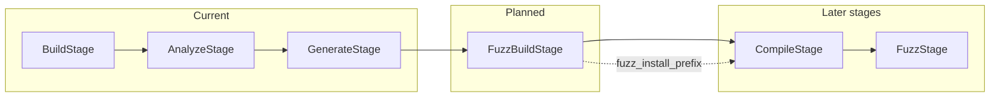

# Fuzz Build Stage (Future Work)

This document describes the planned **Fuzz Build** (instrumentation) stage for FutagAssist. It is intended for future implementation when the compile and fuzz stages are added.

## Purpose

- **Build stage** (current): Produces a CodeQL database only; it does not install the library. No debug/sanitizer flags.
- **Fuzz Build stage** (planned): Builds the library with **debug symbols** and **sanitizers** (AddressSanitizer, UndefinedBehaviorSanitizer, LeakSanitizer) and installs to a **fuzz-specific** prefix (e.g. `<repo>/install-fuzz`). The compile stage will link fuzz targets against this instrumented install so that crashes in library code have readable stack traces and sanitizers can detect bugs inside the library.

CodeQL does not require install or sanitizers; fuzzing requires an instrumented install. Keeping install in a separate Fuzz Build stage reduces build time and complexity for CodeQL-only runs.

## Pipeline placement

- **Depends on:** `build`
- **Order:** `build` → `analyze` → `generate` → **`fuzz_build`** → `compile` → `fuzz` → `report`
- When implemented, add `fuzz_build` to `config/default.yaml` (or `pipeline.yaml`) between `generate` and `compile`.

## Responsibility

1. **Rebuild the library** from source (same repo as build stage).
2. **Inject compiler/linker flags:**
   - Debug: `-g` (or `-g3`)
   - Sanitizers: e.g. `-fsanitize=address,undefined`; LeakSanitizer is often enabled with AddressSanitizer
   - Frame pointers: `-fno-omit-frame-pointer` if needed for readable stacks
3. **Install to a fuzz-specific prefix** (e.g. `<repo>/install-fuzz`) so `<repo>/install` remains the normal install.
4. **Publish** something like `context.fuzz_install_prefix` so the compile stage can link fuzz targets against the instrumented library.

## Mechanics (implementation notes)

- Reuse build command discovery from the build stage (e.g. `ReadmeAnalyzer` or a shared helper). Do **not** run CodeQL; run the build directly with injected `CFLAGS`/`CXXFLAGS`/`LDFLAGS` (and `CC`/`CXX` if needed). Example: `CFLAGS="-g -fsanitize=address,undefined -fno-omit-frame-pointer" ./configure --prefix=<repo>/install-fuzz && make && make install`.
- Make the stage **skippable** (e.g. `--skip fuzz_build`). When skipped, the compile stage would need to build and install the library itself or use another source (no instrumentation).

## Context / data flow

| Output              | Description |
|---------------------|-------------|
| `fuzz_install_prefix` | Path where the instrumented library is installed (e.g. `<repo>/install-fuzz`). Compile stage uses this when building fuzz targets in the full pipeline. |

## Summary

| Stage             | Debug/sanitizers? | Output |
|-------------------|-------------------|--------|
| **Build**         | No                | CodeQL DB only (no install) |
| **Fuzz Build**     | Yes (library)     | Instrumented install (`fuzz_install_prefix`) |
| **Compile**       | Yes (harness)     | Fuzz target binaries; links to `fuzz_install_prefix` when fuzz_build ran |

See [ARCHITECTURE.md](ARCHITECTURE.md) for the overall pipeline and [BUILD_WITH_CODEQL.md](BUILD_WITH_CODEQL.md) for the current build stage behavior.
