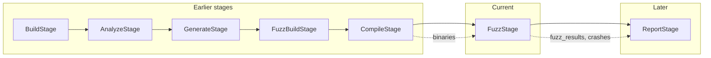

# Fuzz Stage

This document describes the **Fuzz** (fuzzing) stage for FutagAssist. It is implemented in `stages/fuzz_stage.py` and exposed via `futagassist fuzz`.

## Purpose

The fuzz stage takes **compiled fuzz target binaries** (from the compile stage) and runs them through a registered **FuzzerEngine** plugin (e.g. libFuzzer, AFL++). It collects crash artifacts, parses crash logs, deduplicates crashes, and optionally collects coverage data.

## Pipeline placement

- **Depends on:** `compile`
- **Order:** `build` > `analyze` > `generate` > `fuzz_build` > `compile` > **`fuzz`** > `report`



## Inputs

| Input | Source | Description |
|-------|--------|-------------|
| Compiled binaries | Compile stage (`stage_results` or `binaries_dir`) | Fuzz target executables |
| `FuzzerEngine` plugin | Registry | Executes fuzzing, parses crashes, collects coverage |

## Outputs

| Output | Description |
|--------|-------------|
| `fuzz_results` | List of `FuzzResult` objects (one per binary) |
| `results_dir` | Directory containing corpus, artifacts, and coverage per binary |
| `crashes` | Deduplicated list of `CrashInfo` objects across all binaries |
| `unique_crashes` | Count of unique crashes after deduplication |
| `total_duration_seconds` | Total fuzzing wall-clock time |

## How it works

1. **Discover binaries** from the compile stage results or `binaries_dir`
2. For each binary:
   - Create `corpus/` and `artifacts/` directories under `results_dir/<binary_name>/`
   - Call `FuzzerEngine.fuzz(binary, corpus_dir, **options)`
   - Call `FuzzerEngine.parse_crashes(artifact_dir)` to collect crash info
   - Optionally call `FuzzerEngine.get_coverage(binary, profdata)` for coverage
3. **Deduplicate crashes** across all binaries using `(crash_file, crash_line, warn_class)` as key, with backtrace hash as fallback
4. Aggregate results into `StageResult` with summary

## Crash deduplication

Crashes are deduplicated by:
1. `crash_file:crash_line:warn_class` -- when location info is available
2. MD5 hash of backtrace -- when location info is missing but backtrace exists
3. MD5 hash of summary -- as last resort
4. Artifact path or object identity -- absolute fallback

## Fuzzer options

| Option | Default | Description |
|--------|---------|-------------|
| `max_total_time` | `60` | Max fuzzing wall-clock time per binary (seconds) |
| `timeout` | `30` | Timeout per individual test case (seconds) |
| `fork` | `1` | Number of fork workers |
| `rss_limit_mb` | `2048` | RSS memory limit per worker (MB) |
| `artifact_prefix` | `<results_dir>/<name>/artifacts/` | Where to write crash artifacts |

## CLI usage

```bash
# Fuzz all binaries in a directory
futagassist fuzz --binaries ./fuzz_binaries

# Custom output directory and timing
futagassist fuzz --binaries ./fuzz_binaries --output ./results --max-time 300

# Specify fuzzer engine
futagassist fuzz --binaries ./fuzz_binaries --engine libfuzzer

# Multiple fork workers, no coverage
futagassist fuzz --binaries ./fuzz_binaries --fork 4 --no-coverage
```

### Options

| Option | Default | Description |
|--------|---------|-------------|
| `--binaries` | (required) | Directory with compiled fuzz binaries |
| `--output` | `./fuzz_results` | Output directory for results |
| `--engine` | (from config) | Fuzzer engine name |
| `--max-time` | `60` | Max total time per binary (seconds) |
| `--timeout` | `30` | Per-testcase timeout (seconds) |
| `--fork` | `1` | Fork worker count |
| `--rss-limit` | `2048` | RSS limit in MB |
| `--no-coverage` | `false` | Skip coverage collection |

## Configuration (context.config keys)

| Key | Type | Default | Description |
|-----|------|---------|-------------|
| `fuzz_engine` | `str` | from `cfg.fuzzer_engine` | Fuzzer engine name |
| `fuzz_results_dir` | `str` | `<repo>/fuzz_results` | Results output directory |
| `fuzz_max_total_time` | `int` | `60` | Max time per binary |
| `fuzz_timeout` | `int` | `30` | Per-case timeout |
| `fuzz_fork` | `int` | `1` | Fork workers |
| `fuzz_rss_limit_mb` | `int` | `2048` | RSS limit |
| `fuzz_coverage` | `bool` | `True` | Collect coverage |

## Skip logic

The stage can be skipped (`can_skip()` returns `True`) when `context.fuzz_results` is already populated.

See [COMPILE_STAGE.md](COMPILE_STAGE.md) for the compile stage and [REPORT_STAGE.md](REPORT_STAGE.md) for the report stage.
