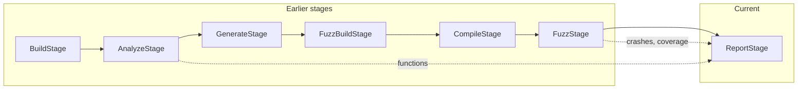

# Report Stage

This document describes the **Report** (reporting) stage for FutagAssist. It is implemented in `stages/report_stage.py` and exposed via `futagassist report`.

## Purpose

The report stage takes pipeline results (functions, crashes, coverage) and generates output reports using registered **Reporter** plugins. Multiple output formats can be produced in a single run (e.g. JSON + SARIF + HTML).

## Pipeline placement

- **Depends on:** `fuzz`
- **Order:** `build` > `analyze` > `generate` > `fuzz_build` > `compile` > `fuzz` > **`report`**



## Inputs

| Input | Source | Description |
|-------|--------|-------------|
| `context.functions` | Analyze stage | Function info for function reports |
| `context.fuzz_results` | Fuzz stage | Crash and coverage data |
| Reporter plugins | Registry | One or more registered Reporter implementations |

## Outputs

| Output | Description |
|--------|-------------|
| `report_output` | Root output directory |
| `written_files` | List of generated report file paths |
| `report_formats` | List of formats that were used |

## How it works

1. **Discover reporters** from the registry (all registered, or a specific list via `report_formats`)
2. **Gather data** from the pipeline context:
   - Functions from `context.functions`
   - Crashes from `context.fuzz_results` (or fuzz stage `StageResult.data`)
   - Coverage from `context.fuzz_results` (picks the result with the most coverage data)
3. For each reporter format:
   - Create `<output_dir>/<format>/` subdirectory
   - Call `reporter.report_functions(functions, path)` if functions exist
   - Call `reporter.report_crashes(crashes, path)` if crashes exist
   - Call `reporter.report_coverage(coverage, path)` if coverage exists
4. Return summary with all written file paths

## Built-in reporter: JSON

The `JsonReporter` is registered as `"json"` and produces:
- `functions.json` -- array of function info objects
- `crashes.json` -- array of crash info objects
- `coverage.json` -- coverage report object

Additional reporter plugins (SARIF, HTML, SVRES) can be registered via the plugin system.

## CLI usage

```bash
# Generate reports from fuzz results
futagassist report --results ./fuzz_results

# Specific output directory
futagassist report --results ./fuzz_results --output ./my_reports

# Specific format(s)
futagassist report --results ./fuzz_results --format json --format sarif

# Include function info from analyze stage
futagassist report --results ./fuzz_results --functions ./analyze_output.json
```

### Options

| Option | Default | Description |
|--------|---------|-------------|
| `--results` | (none) | Directory with fuzz results |
| `--output` | `./reports` | Output directory for reports |
| `--format` | all registered | Report format(s), repeatable |
| `--functions` | (none) | Functions JSON from analyze stage |

## Configuration (context.config keys)

| Key | Type | Default | Description |
|-----|------|---------|-------------|
| `report_output` | `str` | `<repo>/reports` | Output directory |
| `report_formats` | `list[str]` | all registered | Formats to generate |

## Reporter protocol

All reporter plugins must implement the `Reporter` protocol:

```python
class Reporter(Protocol):
    format_name: str

    def report_coverage(self, data: CoverageReport, output: Path) -> None: ...
    def report_crashes(self, crashes: list[CrashInfo], output: Path) -> None: ...
    def report_functions(self, functions: list[FunctionInfo], output: Path) -> None: ...
```

## Skip logic

The stage can be skipped (`can_skip()` returns `True`) when `context.results_dir` is set and contains a `reports/` subdirectory with at least one file.

## File extension mapping

| Format | Extension |
|--------|-----------|
| `json` | `.json` |
| `sarif` | `.sarif` |
| `html` | `.html` |
| `svres` | `.svres` |
| `csv` | `.csv` |

See [FUZZ_STAGE.md](FUZZ_STAGE.md) for the fuzz stage and [ARCHITECTURE.md](ARCHITECTURE.md) for the overall pipeline.
